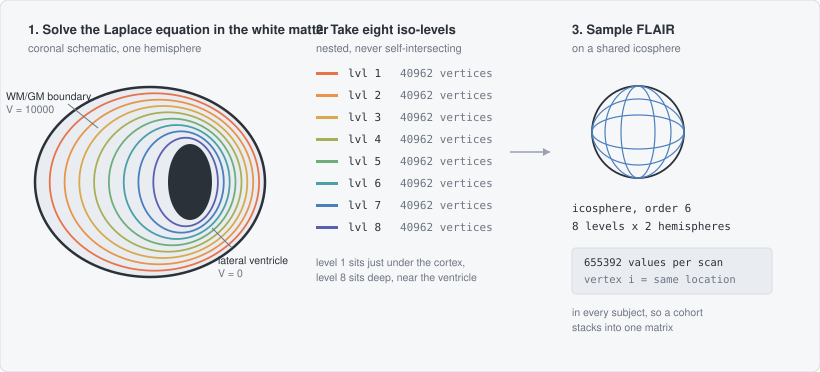

# WM-RegionalBA

Vertex-wise white-matter features for regional brain-age modelling.

Cortical brain-age models sample features on the cortical surface. The white
matter has no such surface — it is a solid volume. This pipeline builds one:
it solves the Laplace equation between the lateral ventricle and the WM/GM
boundary, extracts eight nested iso-potential surfaces from that field, and puts
them all into vertex-wise correspondence across subjects using FreeSurfer's
spherical registration. FLAIR intensity sampled on those surfaces is the feature
vector.

Output per scan: 8 levels × 2 hemispheres × 40962 vertices, where vertex *i* at
level *l* is the same white-matter location in every subject.



## Requirements

Nothing below is redistributed here — you install and license each yourself.
`bin/check_config.sh` verifies every item once you have set them up.

### External software

| | version used | install | needed by |
|---|---|---|---|
| FreeSurfer | 7.1.0 | [download](https://surfer.nmr.mgh.harvard.edu/fswiki/DownloadAndInstall) · [licence (free, academic)](https://surfer.nmr.mgh.harvard.edu/registration.html) | stages 00–06: `recon-all`, `mri_convert`, `mris_smooth`, `mris_inflate`, `mris_sphere`, `mris_curvature`, `mris_register`, `mris_make_template` |
| FSL | 6.x | [install](https://fsl.fmrib.ox.ac.uk/fsl/docs/#/install/index) | stage 07: `bet`, `flirt` |
| MATLAB | R2020b+ | [mathworks.com](https://www.mathworks.com/products/matlab.html) | stages 06–07: icosphere resampling, `.obj` → `.mat` |
| Python | 3.9+ | [python.org](https://www.python.org/downloads/) or [Miniconda](https://docs.conda.io/projects/miniconda/en/latest/) | the `wmba` package |

FreeSurfer only runs on Linux and macOS. On Windows use WSL2 with a Linux
distribution.

### Python packages

All installed by `conda env create -f environment.yml` or `pip install -e .`.

| package | install | used by |
|---|---|---|
| [NumPy](https://numpy.org/install/) `>=1.24,<2.0` | `pip install numpy` | everywhere |
| [SciPy](https://scipy.org/install/) `>=1.10` | `pip install scipy` | `laplacian.py` (the Jacobi solver), `sampling.py` (`.mat` I/O) |
| [NiBabel](https://nipy.org/nibabel/installation.html) `>=5.0` | `pip install nibabel` | reading/writing `.mgz` and `.nii.gz` |
| [MNE-Python](https://mne.tools/stable/install/index.html) `>=1.5` | `pip install mne` | `masking.py`, `marching_cube.py` — FreeSurfer binary surface I/O (`read_surface`, `write_surface`) |
| [scikit-image](https://scikit-image.org/docs/stable/user_guide/install.html) `>=0.21` | `pip install scikit-image` | `marching_cube.py` (`measure.marching_cubes`) |
| [trimesh](https://trimesh.org/install.html) `>=4.0` | `pip install trimesh` | `mesh_utils.py` — voxelising the white surface |
| [PyTorch](https://pytorch.org/get-started/locally/) `>=2.0` | CPU build is enough: `pip install torch --index-url https://download.pytorch.org/whl/cpu` | `mesh_utils.py`, `sampling.py` — `grid_sample` interpolation. **No GPU is used.** |
| [SimpleITK](https://simpleitk.readthedocs.io/en/master/gettingStarted.html) `>=2.3` | `pip install SimpleITK` | `tools/dicom_to_nifti.py` only — optional |

### MATLAB helpers

Stages 06 and 07 call MATLAB functions that must be on `$WMBA_MATLAB_MODULES`.
`bin/check_config.sh` reports which are missing.

| function | source |
|---|---|
| `SurfStatReadSurf1` | [SurfStat](https://math.mcgill.ca/keith/surfstat/) |
| `read_surf`, `read_curv`, `write_curv` | ships with FreeSurfer, in `$FREESURFER_HOME/matlab/` |
| `freesurfer_read_tri`, `writeObjMesh2`, `MeshNormal` | **not from a public package** — see below |

`ic<order>.tri`, which `WMBA_ICO_DIR` points at, ships with FreeSurfer in
`$FREESURFER_HOME/lib/bem/`.

> **Known gap.** `freesurfer_read_tri`, `writeObjMesh2`, `MeshNormal` and the
> `mri_surf2ico.sh` wrapper (`$WMBA_SURF2ICO`) came from the originating lab's
> in-house MATLAB toolbox and are not available from any public source we can
> point you at. Stages 00–02 and the Python stages run without them; stage 06
> (icosphere resampling) does not. They are small: `mri_surf2ico.sh` wraps
> FreeSurfer's `mri_surf2surf`, `freesurfer_read_tri` reads the `.tri` format,
> `MeshNormal` computes per-vertex normals, and `writeObjMesh2` writes an `.obj`.
> Reimplementing them, or substituting `mri_surf2surf` directly, is the practical
> route until they can be replaced in-tree. Please open an issue if you need
> this — it is the main obstacle to running the full pipeline elsewhere.

## Install

```bash
git clone https://github.com/ZCONG2025/wm-regional-ba.git
cd wm-regional-ba

conda env create -f environment.yml && conda activate wmba
# or: pip install -e .

cp config/config.example.sh config/config.sh
$EDITOR config/config.sh          # point it at FreeSurfer, FSL, MATLAB, your data

bin/check_config.sh               # verify it before running anything
```

## Configuration

**There are no paths in the code.** Every location the pipeline touches comes
from one file, `config/config.sh`, which you create from
[`config/config.example.sh`](config/config.example.sh) and edit. It is
git-ignored, so your paths never leave your machine.

Three things read it, so you only ever set a path once:

- **Shell stages** — every script in `bin/` sources `bin/lib/common.sh`, which
  sources your config. You never pass a path on the command line.
- **Python stages** — each takes `--data-dir`, defaulting to `$WMBA_DATA_DIR`.
- **MATLAB stages** — read `WMBA_ICO_DIR`, `WMBA_SURF2ICO` and `WMBA_ICO_ORDER`
  from the environment; `MATLABPATH` is assembled from `$WMBA_MATLAB_MODULES`.

Every setting is written `${VAR:-default}`, so exporting a variable beforehand
overrides the file without editing it — useful for one-off runs and for cluster
jobs:

```bash
WMBA_DATA_DIR=/scratch/$USER/wmba bin/run_subject.sh SUBJ01 ...
```

### What you must set

| | |
|---|---|
| `FREESURFER_HOME` | your FreeSurfer install |
| `FSLDIR` | your FSL install |
| `WMBA_PYTHON` | interpreter with `requirements.txt` installed (e.g. `.../envs/wmba/bin/python`) |
| `WMBA_MATLAB`, `WMBA_MATLAB_MODULES` | MATLAB binary, and the directory holding SurfStat + the FreeSurfer MATLAB helpers |
| `WMBA_ICO_DIR`, `WMBA_SURF2ICO` | directory with `ic<order>.tri`, and the `mri_surf2ico.sh` wrapper |
| `WMBA_T1_DIR`, `WMBA_FLAIR_DIR` | where your input NIfTIs live |
| `WMBA_DATA_DIR`, `WMBA_TEMPLATE_DIR`, `WMBA_TMP_DIR`, `WMBA_FS_DIR` | outputs; default to `work/` inside the repo, move them to fast scratch for real cohorts |

Optional and safely left empty: `WMBA_SYNTHSEG_*` (stage 08, QC only — nothing
downstream reads its output). Cluster settings live separately in
`cluster/queue.conf` (see `cluster/queue.conf.example`), and are only needed if
you submit cohorts through SGE.

### FreeSurfer specifically

Set `FREESURFER_HOME` and nothing else — the pipeline sources
`$FREESURFER_HOME/SetUpFreeSurfer.sh` itself and manages `SUBJECTS_DIR` per
stage, so you do not need FreeSurfer already active in your shell.

The **licence file is yours to obtain**; it is deliberately not in this
repository. Register (free, academic) at
<https://surfer.nmr.mgh.harvard.edu/registration.html> and either drop
`license.txt` into `$FREESURFER_HOME`, or set `FS_LICENSE` to wherever you keep
it — useful when FreeSurfer is a read-only shared install:

```bash
export FS_LICENSE=$HOME/.freesurfer/license.txt
```

`bin/check_config.sh` verifies the licence is found, sources the environment,
and confirms each FreeSurfer tool the pipeline calls is on `PATH`. It also
prints your FreeSurfer version — **record it in your methods**, because surface
outputs are not identical across major versions. This pipeline was developed
against 7.1.0.

### Checking the configuration

```bash
bin/check_config.sh
```

Reports `OK` / `SKIP` / `FAIL` per item, with the fix in each failure message,
and exits non-zero if the core pipeline cannot run. `SKIP` covers optional
stages and a template you have not built yet. Run it before submitting a
cohort — it costs a second and saves a day of cluster time.

## Run

### First: you need a template

Every subject's mid-surfaces are registered to a shared **surface registration
template**, which is what puts vertex *i* at the same anatomical location in
every subject. Nothing downstream works without one, so this is the first fork
in the road:

| | Do this | Cost |
|---|---|---|
| **A. Use an existing template** | `bin/install_template.sh <dir-or-archive>` | seconds |
| **B. Build your own** | stages 03–05, see [`docs/pipeline.md`](docs/pipeline.md#building-a-template) | a few hundred subjects × ~a day each |

**Option A is what you want unless you have a reason not to.** The template used
for the reference analysis is published as a release asset — 16
`<hemi>lvl<level>_1.tif` files (2 hemispheres × 8 levels), built from 399 ADNI
subjects:

```bash
curl -LO https://github.com/ZCONG2025/wm-regional-ba/releases/latest/download/wmba-template-adni399.tar.gz
bin/install_template.sh wmba-template-adni399.tar.gz
bin/check_config.sh                                # confirms all 16 are present
```

The installer verifies the whole set before copying anything, so an incomplete
template fails immediately rather than three hours into a run, and it tells you
if the template was built for a different set of levels than your
`WMBA_LEVELS`. Template files are not in the repository itself — they are large
binaries, and `.gitignore` blocks `*.tif` deliberately.

> **Input geometry.** The published template is intended for T1 images that are
> **1 mm isotropic with whole-brain coverage** — the geometry of the UK Biobank
> data the reference brain-age models were trained on. `recon-all` conforms any
> input to 256³ at 1 mm, so the acquisition matrix does not have to match; what
> matters is the voxel size and the coverage. Coarser or anisotropic data is
> interpolated during conforming, which smooths the surfaces and shifts the
> sampled FLAIR values; a truncated field of view truncates the white-matter
> surface and degrades the registration. If your data differs materially on
> either count, prefer option B.

**Build your own (option B) when:** your data is not 1 mm isotropic whole-brain;
your cohort differs substantially in age, scanner or pathology from the template
cohort; you changed `WMBA_LEVELS`; or you want the template derived from your own
data for methodological reasons. Registering to a template built on a different
population is usually fine — that is the point of a template — but it is a choice
you should be able to defend.

### What you need per scan

Two NIfTI images of the same person at the same session:

```
$WMBA_T1_DIR/I123455.nii.gz        T1-weighted, whole head, not skull-stripped
$WMBA_FLAIR_DIR/I123456.nii.gz     FLAIR, same session
```

The basenames are the "image ids" you pass on the command line. Any naming
scheme works; the pipeline only needs the two files to exist where
`config/config.sh` points.

### One subject

```bash
bin/run_subject.sh SUBJ01 "$WMBA_T1_DIR/I123455.nii.gz" I123456 0
```

Arguments: subject id, T1 file, FLAIR image id, scan/session id.

That one command runs the whole chain — FreeSurfer `recon-all`, the Laplace
solve, eight iso-surfaces per hemisphere, spherical registration to the
template, icosphere resampling, FLAIR sampling. Steps whose output already
exists are skipped, so rerunning after a failure resumes rather than restarts.

**It is slow.** Roughly 8–14 h for `recon-all`, 10–40 min per hemisphere for the
Laplace solve, and 5–20 min per level per hemisphere for the registration — on
the order of a day per scan on one core. This is a cluster pipeline.

### What lands on disk

```
$WMBA_DATA_DIR/SUBJ01/0/
├── aseg.mgz  brain.mgz  lh.white  rh.white     staged from FreeSurfer
├── T1.nii.gz                                   conformed, skull-stripped
├── I123456_FLAIR_converted.nii.gz              FLAIR aligned to the T1
├── mask/
│   ├── lap_mask_lh.nii                         Laplace domain  (1 / 2 / 3)
│   └── lap_lh.nii                              potential field (0 .. 10000)
└── midsurf/
    ├── lvl1/
    │   ├── lh.sphere  lh.sphere.reg1           spherical registration
    │   ├── lh_lvl1_ico_6.obj                   surface on the icosphere
    │   ├── lh_coord.mat                        its vertex coordinates
    │   ├── I123456_lh.txt   ◄── THE OUTPUT     40962 FLAIR intensities
    │   └── I123456_rh.txt   ◄── THE OUTPUT
    ├── lvl2/  ...
    └── lvl8/  ...
```

Everything except those `.txt` files is intermediate. **The result is 16 text
files per scan** (8 levels × 2 hemispheres), one float per line, 40962 lines
each.

### Loading the result

```python
import numpy as np

def load_scan(data_dir, subject, scan, flair_id, levels=range(1, 9)):
    """-> (8, 2, 40962) array indexed by level, hemisphere, vertex."""
    return np.array([
        [np.loadtxt(f"{data_dir}/{subject}/{scan}/midsurf/lvl{lv}/{flair_id}_{h}.txt")
         for h in ("lh", "rh")]
        for lv in levels
    ])

x = load_scan("/work/data", "SUBJ01", "0", "I123456")
x.shape        # (8, 2, 40962)
x.reshape(-1)  # flat feature vector, 8*2*40962 elements
```

Vertex *i* at level *l* is the same white-matter location in every subject, so a
cohort stacks straight into an `(n_subjects, 8*2*40962)` matrix. Feed that to
whatever brain-age model you like — **this repository produces the features, it
does not fit the model.**

### A cohort on an SGE cluster

One line per scan, `<subject> <t1_id> <flair_id> [scan]`:

```
SUBJ01  I123455  I123456  0
SUBJ02  I223455  I223456  0
```

```bash
python cluster/make_array_job.py subjects.tsv jobs/cohort.arr
cluster/submit_array.sh jobs/cohort.arr 300 50     # 300 tasks, 50 at a time
```

Parallelise across subjects only, never across levels within one subject — see
[`docs/known_issues.md`](docs/known_issues.md) §3.

### Checking progress

```bash
python tools/check_completion.py --stage feature --flair-id I123456
```

Prints every incomplete scan and exits non-zero if anything is missing, so it
works as a gate in a script. `--stage sphere` and `--stage obj` check the
earlier stages, which is where failures actually happen.

### Building a template from scratch

Only if you chose option B above. It is a one-off job whose cost is a few hundred
subjects through stage 02, twice over; the full procedure, and the two-pass
rationale, is in
[`docs/pipeline.md`](docs/pipeline.md#building-a-template).

## Documentation

| | |
|---|---|
| [`docs/pipeline.md`](docs/pipeline.md) | what each stage does, how to build a template, output format |
| [`docs/references.md`](docs/references.md) | what to cite in a methods section, with BibTeX |
| [`docs/known_issues.md`](docs/known_issues.md) | **read before trusting the output** — behaviour that differs from what the code appears to intend |
| [`docs/docker.md`](docs/docker.md) | containerised Python stages, and why the full pipeline cannot be one image |
| [`docs/FILE_MAP.md`](docs/FILE_MAP.md) | how this repository maps onto the original research scripts |

## Data

No subject data is included. This pipeline was developed on
[ADNI](https://adni.loni.usc.edu/), whose Data Use Agreement prohibits
redistributing subject-level data — including id lists, scan dates and clinical
variables, not only images. Apply for access directly. `.gitignore` blocks the
relevant file types so they cannot be committed by accident.

## Citing

If this pipeline contributes to work you publish, please cite it — see
[`CITATION.cff`](CITATION.cff) (GitHub renders a "Cite this repository" button).

A methods section should also credit the work this is built on:
[Jones et al. 2000](docs/references.md) for the Laplace construction,
FreeSurfer for the surface registration, and Vox2Cortex for the mesh utilities.
[`docs/references.md`](docs/references.md) lists all of them, with BibTeX.

## Licence

**GPL-3.0-only** — see [`LICENSE`](LICENSE). You may use, modify and
redistribute this code, but anything you distribute that builds on it must also
be released under the GPL-3.0.

This is inherited, not chosen: `wmba/mesh_utils.py` adapts coordinate-transform
and feature-aggregation code from [Vox2Cortex](https://github.com/ai-med/Vox2Cortex),
which is GPL-3.0. [`NOTICE`](NOTICE) lists exactly which functions and how they
were modified.

The licence covers the code in this repository only. FreeSurfer, FSL, MATLAB,
SurfStat and SynthSeg each carry their own licence and must be obtained
separately.
